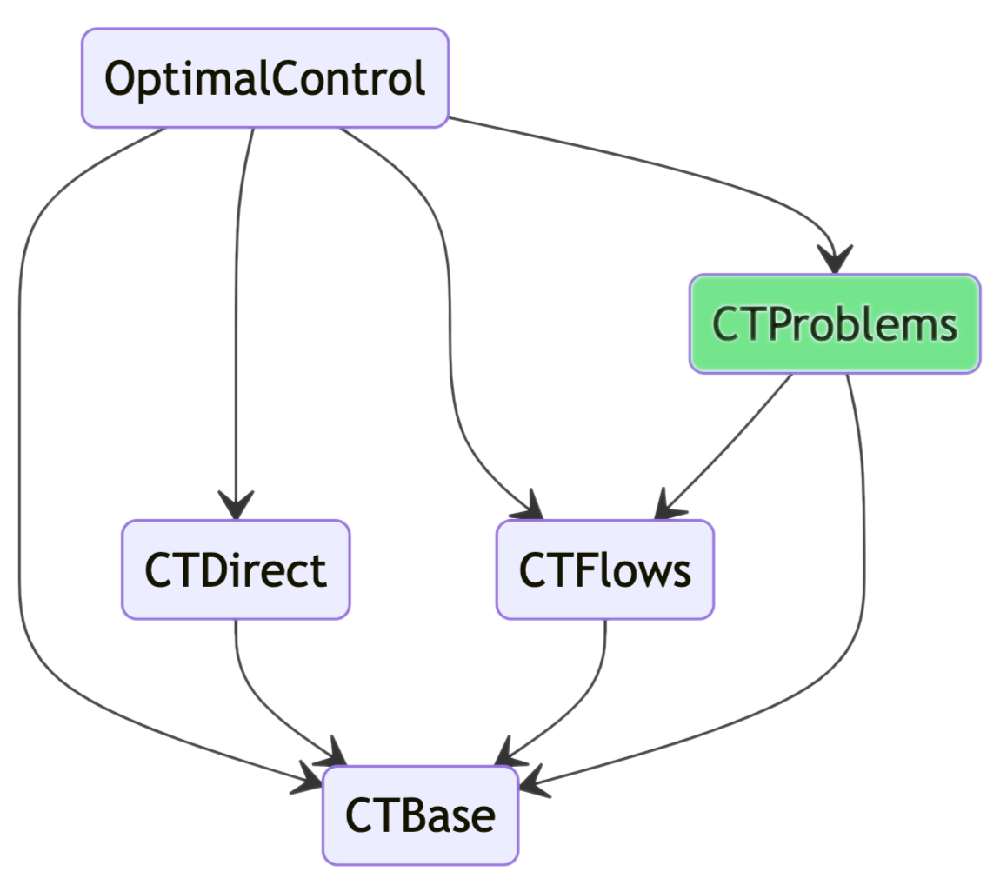

# [CTProblems.jl](@id introduction)

The `CTProblems.jl` package is part of the [control-toolbox ecosystem](https://github.com/control-toolbox).

```@raw html

```

!!! note "Install"

    To install a package from the control-toolbox ecosystem, 
    please visit the [installation page](https://github.com/control-toolbox#installation).

This package provides a [list of optimal control problems](@ref problems-list). Each problem is composed of a short title, a model and the solution. You can get access to any problem by a simple [`Description`](https://control-toolbox.org/CTDocs.jl/ctbase/stable/api-description.html), that is a tuple of (Julia) symbols.

For instance, to get the energy minimisation exponential problem, simply

```@example main
using CTProblems
prob = Problem(:exponential, :energy)
```

!!! note

    In the example above, we have given a partial description to the function `Problem`. 
    The complete description of this problem is

    ```bash
    (:exponential, :energy, :x_dim_1, :u_dim_1, :lagrange)
    ```

!!! warning

    If you give a partial description, then, if several complete descriptions contains the partial one, then, only the problem with the highest priority is returned. The higher in the list, the higher is the priority.
    See the [list of descriptions](@ref descriptions-list) to check the priorities.

Once you have selected a problem, you can get access to its title:

```@example main
prob.title
```

Its model is given by

```@example main
prob.model
```

And you can plot the solution.

```@example main
plot(prob.solution, size=(700, 500))
```
